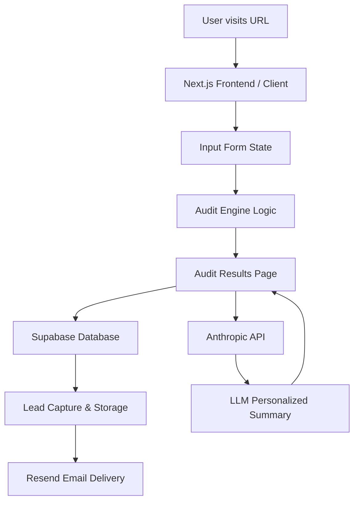

# Architecture

## System Diagram

## Data Flow

1. **Input:** The user enters their tool usage, team size, and primary use case on the client. This state is managed via React state (Zustand) and persisted to local storage to survive reloads.
2. **Audit Engine:** The input is passed synchronously to the core `auditEngine` logic function. This uses predefined pricing rules to identify overspend and downgrade/swap opportunities.
3. **LLM Enrichment:** Once the base math is complete, the frontend makes an API call to the Next.js server route, which calls the Anthropic API to generate a personalized ~100-word summary of the savings based on the user's specific context.
4. **Lead Capture:** If the user opts to receive the report or a consultation, their email and metadata are submitted to a Supabase database table.
5. **Notification:** The database insertion triggers an edge function (or API route) that uses Resend to send a transactional confirmation email.
6. **Sharing:** A unique URL parameter or database ID is generated to allow the result to be shared publicly with sensitive data redacted.

## Stack Choice Justification

- **Next.js (App Router):** Chosen for its hybrid rendering model. We can serve the landing page and form as fast static/client components, while keeping the Anthropic API key securely on the server via Server Actions/Route Handlers.
- **TypeScript:** Enforces strict types for the Pricing rules and subscriptions, ensuring the math in the audit engine is reliable and predictable.
- **Tailwind CSS:** Allows for rapid, utility-first styling to ensure high visual quality and responsiveness without the overhead of external UI libraries or complex CSS modules.
- **Zustand:** Used for lightweight state management across the multi-step form to avoid prop drilling.

## Scaling to 10k Audits/Day

If this tool scaled to 10,000 audits per day:
1. **Database:** I would introduce Redis caching for the generated LLM summaries based on deterministic input hashes to reduce Anthropic API costs and latency.
2. **Background Jobs:** Lead capture and email sending would be moved to a queue (like Inngest or Upstash QStash) rather than blocking the main thread or relying entirely on serverless execution timeouts.
3. **Edge Deployment:** I would deploy the audit logic to Edge runtimes (Cloudflare Workers or Vercel Edge) to ensure minimal latency for the instant math calculation globally.
